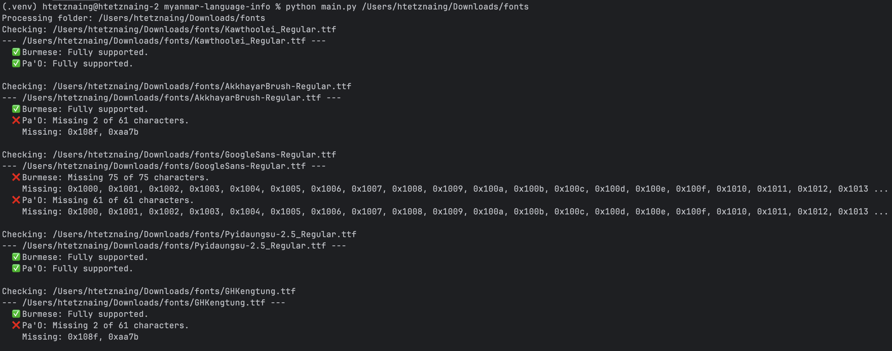

# Myanmar Font Language Checker

This tool helps determine which Myanmar languages are supported within a font file.

The Unicode "Myanmar" block encompasses various languages, including Burmese, Shan (Tai), Mon, Pa'O, Karen, Palaung, Rakhine, Pali, and more, all of which share code points. Currently, there isn't a readily available tool or standardized method to precisely identify which specific languages are contained within a font.

This tool aims to provide a way to check font support for these diverse languages. I hope it proves valuable for developers and linguists working with Myanmar scripts.

## Contribute Your Language Data

Since I don't have comprehensive knowledge of all Myanmar languages, **your contributions are highly welcome!** You can add definitions for additional languages by contributing to the `lang` directory.

Currently, this tool supports:
-   [Burmese](https://en.wikipedia.org/wiki/Burmese_language)
-   [Pa'O](https://en.wikipedia.org/wiki/Pa%27O_language)
-   [Shan](https://en.wikipedia.org/wiki/Shan_language) (contributed by [@SaingHmineTun](https://github.com/SaingHmineTun))

## Setup

1.  Clone the repository:
    
    ```bash
    git clone https://github.com/KhunHtetzNaing/Myanmar-Font-Language-Checker.git
    cd Myanmar-Font-Language-Checker
    ```
    
2.  Create virtual environment:
    
    ```bash
    python3 -m venv .env
    source .env/bin/activate  # Linux/macOS
    .env\Scripts\activate     # Windows
    ```
    
3.  Install dependencies:
    
    ```bash
    pip install -r requirements.txt
    ```
    

## Usage

```bash
python main.py <font_file_or_folder>
```

**Examples:**

```bash
python main.py my_font.ttf
python main.py /path/to/fonts_folder
python main.py /path/to/fonts_folder -o report.txt
```


## Contributing

Contributions are welcome! Please fork the repository, add language data, and create a pull request.

## References

-   [Unicode Technical Note #11](https://www.unicode.org/notes/tn11/UTN11_4.pdf)
-   [Unicode Myanmar Block Chart](https://www.unicode.org/charts/PDF/U1000.pdf)